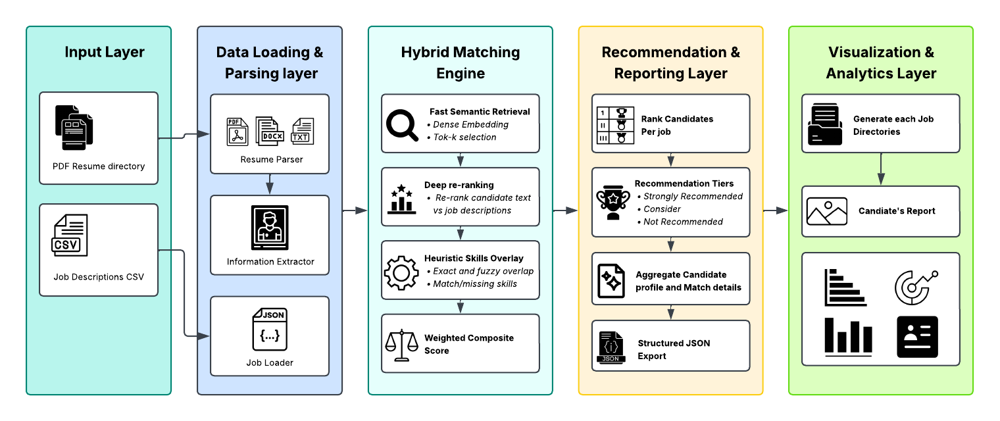
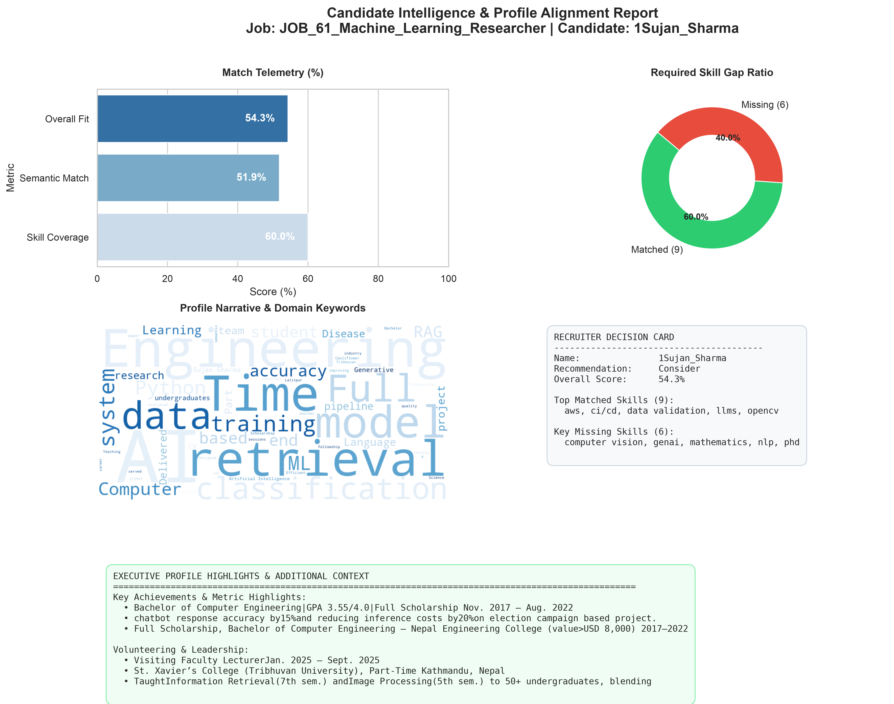

# ResuMatch

**ResuMatch** is an automated resume matching and candidate recommendation system. It leverages a hybrid pipeline combining dense semantic retrieval, cross-encoder re-ranking, and heuristic skill extraction to evaluate and rank candidate resumes against job descriptions across multiple industry categories.

---

## Features

- **Multi-Format Parsing:** Supports `.pdf`, `.docx`, and `.txt` resumes.
- **Hybrid Matching:** Uses bi-encoder retrieval and cross-encoder re-ranking.
- **Skill Extraction:** Extracts contact details, experience, and skills.
- **Skill Gap Analysis:** Identifies matched, missing, and related skills.
- **Recommendation:** Classifies candidates as *Strongly Recommended*, *Consider*, or *Not Recommended*.
- **Visual Reports:** Generates reports with match scores and skill gaps.
- **JSON Export:** Saves detailed matching results in JSON format.


## Project Structure

```text
RESUMATCH/
├── data/
│   ├── data_preparation/       # Notebooks & processing scripts for raw datasets
│   └── sample_data/            # Sample resumes and job description CSV files
|       └── jobs
        └── resumes
├── reports/
│   ├── jobs/                   # Generated visual analytics and candidate reports
│       └── Job_101/
|   └──batch_recommendations.json
├── resumatch/                  # Core ResuMatch Application Package
│   ├── extractor/
│   │   ├── constants.py        # Regex definitions, skill taxonomies, and keywords
│   │   └── resume_extractor.py # Candidate profile feature extraction
│   ├── matcher/
│   │   ├── heuristics.py       # Skill overlap and string matching logic
│   │   ├── reranker.py         # Stage 2 Cross-Encoder re-ranking module
│   │   ├── resume_matcher.py   # Hybrid matching orchestration engine
│   │   └── retriever.py        # Stage 1 Bi-Encoder vector retrieval
│   ├── parser/                 # Document parsing drivers (PDF/DOCX/TXT)
|   |   └── resume_parser.py
│   ├── utils/
│   │   └── job_loader.py       # CSV job description loader and category filter
|   |   └── models.py           # Data models and schema definitions
│   ├── __main__.py             # Main CLI execution entry point
|   ├── app.py                  # Main file of functions controlling overall pipeline             
│   └── recommender.py          # Batch recommendation orchestrator
|   └── visualizer.py           # Report and chart generation script
├── tests/                      # Unit and integration tests
├── pyproject.toml              # Dependency definitions and package configuration
└── README.md

```

---   

## System Architecture



 *([View on Lucidchart](https://lucid.app/lucidchart/31e388a0-668d-48c1-838d-0a3df4a2aa01/edit?viewport_loc=-109%2C-220%2C1762%2C1151%2C0_0&invitationId=inv_ff8f7132-20d4-4184-84e6-53e8cc96c513))*


The processing pipeline is organized into five modular layers:

1. **Input Layer**
   * **PDF Resume Directory:** Ingests candidate resumes in multiple formats (`.pdf`, `.docx`, `.txt`).
   * **Job Descriptions CSV:** Loads structured job description datasets.

2. **Data Loading & Parsing Layer**
   * **Resume Parser (`resumatch.parser`):** Extracts raw text from candidate document files.
   * **Information Extractor (`resumatch.extractor`):** Parses unstructured resume text into structured candidate profile entities.
   * **Job Loader (`resumatch.utils.job_loader`):** Standardizes CSV job records into normalized job dictionary objects.

3. **Hybrid Matching Engine (`resumatch.matcher`)**
   * **Fast Semantic Retrieval (`retriever.py`):** Employs dense vector embeddings (`all-MiniLM-L6-v2`) for initial candidate selection.
   * **Deep Re-ranking (`reranker.py`):** Uses Cross-Encoder models (`BAAI/bge-reranker-base`) to score semantic affinity.
   * **Heuristic Skills Overlay (`heuristics.py`):** Performs exact and fuzzy skill matching to identify matched vs. missing skill sets.
   * **Weighted Composite Score:** Synthesizes semantic relevancy and skill overlap into a unified candidate match score.

4. **Recommendation & Reporting Layer (`resumatch.recommender`)**
   * **Candidate Ranking:** Ranks candidates per target job position.
   * **Recommendation Tiers:** Classifies candidates into *Strongly Recommended*, *Consider*, or *Not Recommended*.
   * **Structured JSON Export:** Aggregates profile metrics and match diagnostics into standard JSON outputs.

5. **Visualization & Analytics Layer (`resumatch.visualizer`)**
   * **Job Directory Generation:** Automatically organizes output directories under `reports/` for each Job ID.
   * **Candidate Visual Reports:** Renders visual match summaries, analytics charts, and individual candidate reports.

---   


## Sample Visual Report

ResuMatch automatically generates individual candidate intelligence reports featuring match telemetry, skill gap ratios, profile word clouds, and recruiter decision summary cards.



---

## Requirements

- Python `>= 3.10`
- `uv` (recommended) or `pip`

## Installation

Clone the repository and install the package:

```bash
git clone https://github.com/SujanSB/ResuMatch.git
   
cd ResuMatch

uv pip install -e .    
```

## Usage
### Run the ResuMatch pipeline:
``` bash 
uv run -m resumatch
```

You can also specify custom input and output paths:

```bash
uv run -m resumatch \
  --resumes_dir data/sample_data/resumes \
  --jobs_csv data/sample_data/jobs/final_job_descriptions.csv \
  --output_dir reports \
  --max_resumes 3
``` 

### Command-Line Arguments

| Argument        | Description                                | Default                                      |
|-----------------|--------------------------------------------|----------------------------------------------|
| `--resumes_dir` | Directory containing candidate PDF resumes | `data/sample_data/resumes`                   |
| `--jobs_csv`    | Job descriptions CSV file                  | `data/sample_data/jobs/final_job_descriptions.csv` |
| `--output_dir`  | Directory for generated reports            | `reports`                                    |
| `--max_resumes` | Maximum number of resumes to process       | `3`                                          |


## Dataset  
The project includes sample candidate resumes and job descriptions under:
``` bash
data/sample_data/
├── resumes/
└── jobs/
```
Resumes are provided as PDF files. Job descriptions are provided as a CSV file.   

---

## Output
The generated results are saved under the specified output directory:
``` bash 
reports/
├── batch_recommendations.json
└── jobs/
    └── JOB_61_Data_Analyst/
        ├── Sujan_Sharma_report.png
        └── Candidate_Name_report.png
``` 
- ```batch_recommendations.json``` contains the candidate matching and recommendation results.

- PNG files contain the generated visual candidate reports.
---

### Development
The project uses Ruff for formatting and linting:
``` bash 
uv run ruff format .
uv run ruff check .
``` 
### Tests can be run with:
``` bash
uv run pytest tests/test_overall_pipeline.py
```

---
## Limitations

1. **Synthetic Data:** Default datasets may not fully represent real-world resumes and job descriptions.
2. **Rule-Based Extraction:** Regex and static skill taxonomies may miss unconventional skills, formats, or sections.
3. **Static Models:** Embeddings and skill weights are not fine-tuned for recruitment domains.

---

## Future Work

1. **LLM-Based Extraction:** Use LLMs for flexible and contextual entity and skill extraction.
2. **Domain Fine-Tuning:** Fine-tune retrieval and re-ranking models on real-world HR datasets.
3. **Dynamic Skill Mapping:** Use knowledge graphs or GNNs to capture relationships between related skills.